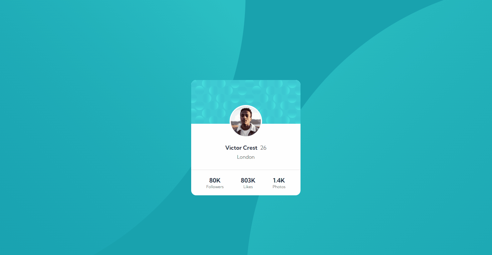
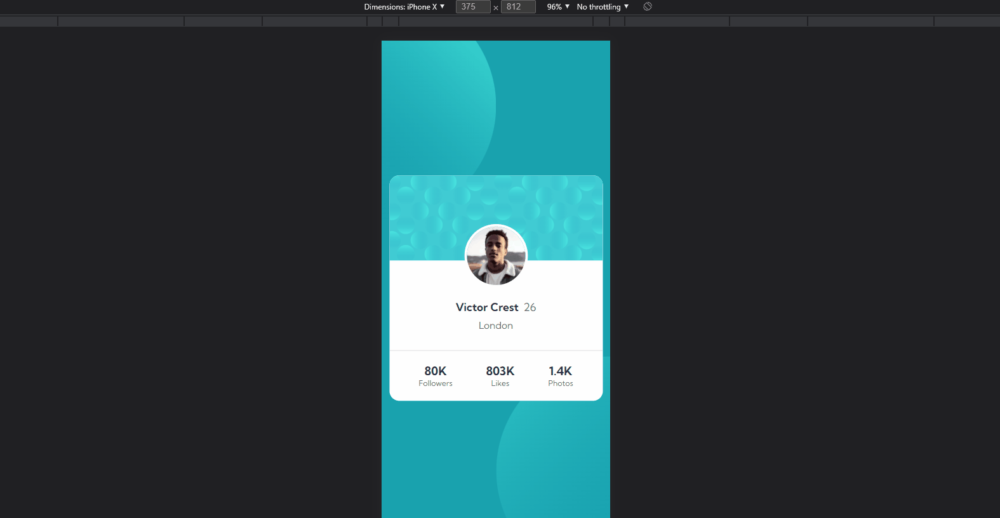

# Frontend Mentor - Profile card component solution

This is a solution to the [Profile card component challenge on Frontend Mentor](https://www.frontendmentor.io/challenges/profile-card-component-cfArpWshJ). Frontend Mentor challenges help you improve your coding skills by building realistic projects. 

## Table of contents

- [Overview](#overview)
  - [The challenge](#the-challenge)
  - [Screenshot](#screenshot)
  - [Links](#links)
- [My process](#my-process)
  - [Built with](#built-with)
  - [What I learned](#what-i-learned)
  - [Continued development](#continued-development)
  - [Useful resources](#useful-resources)
- [Author](#author)
- [Acknowledgments](#acknowledgments)


## Overview

### The challenge

- Build out the project to the designs provided

### Screenshot

#### Desktop


#### Mobile


#### Extreme


### Links

- Solution URL: [https://github.com/obasekiosa/profile-card-component](https://github.com/obasekiosa/profile-card-component)
- Live Site URL: [https://obasekiosa.github.io/profile-card-component](https://obasekiosa.github.io/profile-card-component)

## My process

### Built with

- Semantic HTML5 markup
- CSS custom properties
- Flexbox
- Mobile-first workflow
- [React](https://reactjs.org/) - JS library

### What I learned

This tested my knowledge of images, absolute positioning and relative units (vh, vw)

Keeping the images at the edges of the screen and overlapping a bit at the center required some interesting positioning and preparing of the outer container i.e `.App`
```css
.App {
  background-color: $dark-cyan;
  overflow: hidden;

  display: flex;
  flex-direction: column;
  position: relative;
  justify-content: center;
  align-items: center;
  
  height: 100vh;

  .main {
    position: absolute;
    z-index: 2;
  }

  .top-bg-img {
    position: absolute;
    top: -10vh;
    left: -50vw;
    z-index: 0;
    
    @media screen and (min-width: 767px) {
      top: -100vh;
      left: -50vw;
    }
  }

  .bottom-bg-img {
    position: absolute;
    bottom: -10vh;
    right: -50vw;
    z-index: 0;
    

     @media screen and (min-width: 767px) {
      bottom: -100vh;
      right: -50vw;
    }
  }

  .bottom-bg-img, .top-bg-img {

    img {
      width: 100%;
    }

    width: 100vw;
    display: flex;
    justify-content: center;
    align-items: center;
  }
}
```

### Continued development

Use this section to outline areas that you want to continue focusing on in future projects. These could be concepts you're still not completely comfortable with or techniques you found useful that you want to refine and perfect.

### Useful resources

- [Example resource 1](https://www.example.com) - This helped me for XYZ reason. I really liked this pattern and will use it going forward.
- [Example resource 2](https://www.example.com) - This is an amazing article which helped me finally understand XYZ. I'd recommend it to anyone still learning this concept.


## Author

- Website - [Osakpolor Obaseki](https://obasekiosa.github.io)
- Frontend Mentor - [@obasekiosa](https://www.frontendmentor.io/profile/obasekiosa)
- Twitter - [@obasekiosa](https://www.twitter.com/obasekiosa)

## Acknowledgments

This is where you can give a hat tip to anyone who helped you out on this project. Perhaps you worked in a team or got some inspiration from someone else's solution. This is the perfect place to give them some credit.
